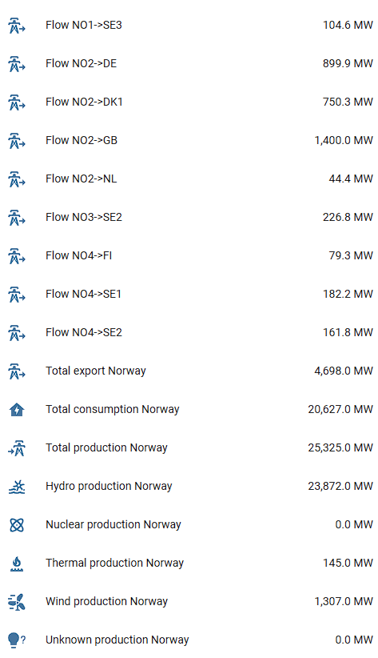

# Nordic Grid Info integration for Home Assistant

[![GitHub Release][releases-shield]][releases]

This integration fetches "live" data from Statnetts API. Statnett displays these data here: https://www.statnett.no/for-aktorer-i-kraftbransjen/tall-og-data-fra-kraftsystemet/#nordisk-kraftflyt

The data is updated every minute.

## Installation

## Sensors

This integration provides the following sensors for chosen country:

| Name | Unit | Description |
|------|------|-------------|
| Total production {country} | MW | Total generation for the entire country.  |
| Total consumption {country} | MW | Total consumption for the entire country. Calculated value; consumption = production - export + import. |
| Total export {country} | MW | Total export for the entire country. Negative value indicates import. |

If you have chosen to get sensors for each production type you will get the following sensors in addition:

| Name | Unit | Description |
|------|------|-------------|
| Hydro production {country} | MW | Total generation from hydro power plants for the entire country.  |
| Nuclear production {country} | MW | Total generation from nuclear power plants for the entire country. |
| Thermal production {country} | MW | Total generation from thermal power plants for the entire country.  |
| Wind production {country} | MW | Total generation from wind power plants for the entire country.  |
| Unknown production {country} | MW | Total generation from not specified power plants for the entire country.  |

If you have chosen to get sensors for each market corridor out of your country you will get sensors like this one (ex. NO1->SE3):

| Name | Unit | Description |
|------|------|-------------|
| Flow NO1->SE3 | MW | Total export from NO1 towards SE3. Negative value indicates import. The arrow indicates positive flow direction. |

### Example of all sensors if you choose Norway

[releases]: https://github.com/grotteru/home_assistant_nordicgridinfo/releases
[releases-shield]: https://img.shields.io/github/release/grotteru/home_assistant_nordicgridinfo.svg?style=popout